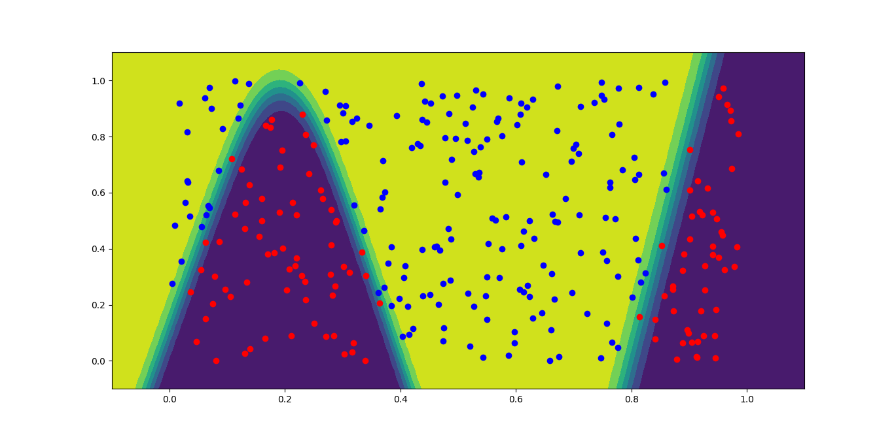
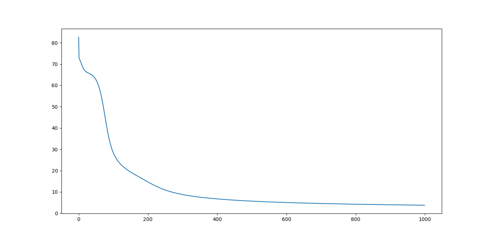
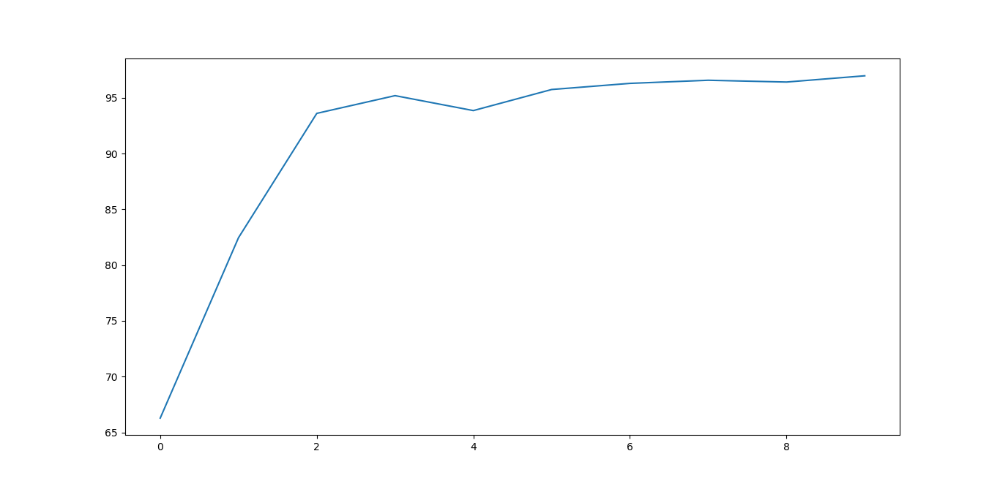
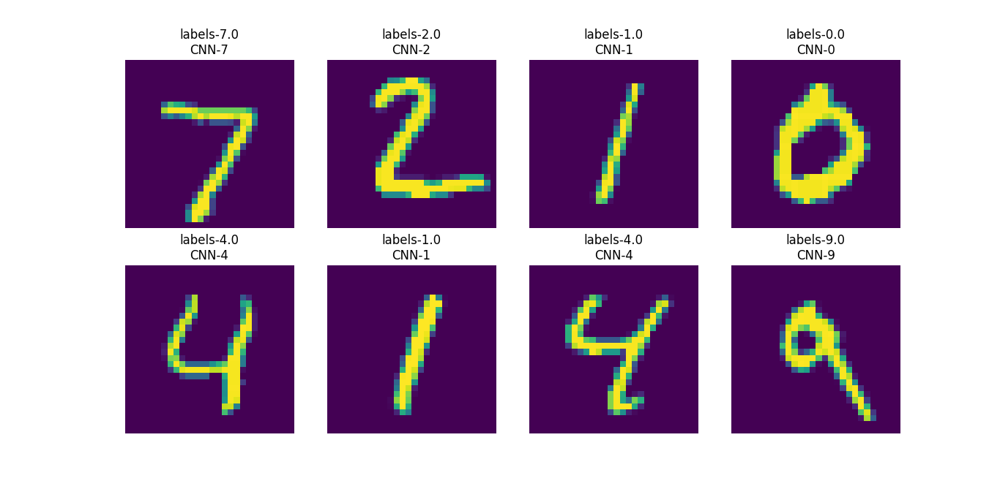

# 一、概述
基于Python.Numpy实现卷积神经网络，识别手写数字

# 二、文件夹结构功能
### 1.文件夹
- data：mnist手写数字数据集，包含训练、测试数据
- parameters：神经网络训练结果保存路径
- figure：该文档中的图片
### 2.文件
- activate.py：激活函数层，包含Sigmoid，SoftMax
- bp.py：BP神经网络层，全连接层
- BPmain.py：BP神经网络测试文件
- CNNmain.py：卷积神经网络测试文件
- conv.py：卷积层
- load_mnist.py：mnist数据加载
- module.py：网络层、结构接口定义
- pool.py：池化层
- saveandread.py：神经网络参数保存加载

# 三、项目运行
## 1.BP神经网络测试
### 1.1测试目标
- 使用BP神经网络对数据进行分类
### 1.2测试方式
- 运行BPmain.py文件
### 1.3测试结果
- 1.训练完成后输出如下
```bash
开始训练: 2023-02-18 20:16:09.905283
训练已完成练100%
结束训练: 2023-02-18 20:16:56.179266
```
- 2.测试结果如下图所示，可以看到，神经网络可以将红点与蓝点进行分类


- 3.训练误差如下图所示，可以看到，训练过程中误差在不断缩小




## 2.卷积神经网络测试
### 2.1测试目标
- 使用卷积神经网络识别手写数字
### 2.2测试方式
- 运行CNNmain.py文件
### 2.3测试结果
- 1.训练完成后输出如下
```bash
第1次训练开始: 2023-02-18 18:45:01.447278
训练已完成100%
第1次训练结束: 2023-02-18 19:39:28.603512
测试已完成100%
第1次测试结束: 2023-02-18 19:43:05.641130
第1次训练正确率:66.28% 


第2次训练开始: 2023-02-18 19:43:05.651106
训练已完成100%
第2次训练结束: 2023-02-18 20:46:34.102317
测试已完成100%
第2次测试结束: 2023-02-18 20:51:22.949554
第2次训练正确率:82.46% 


第3次训练开始: 2023-02-18 20:51:22.957532
...
```
- 2.训练后测试正确率如下图所示，可以看到，随着训练次数增加，正确率在不断提高



## 3.CNN参数读取测试
### 3.1测试目标
- 读取训练时保存的参数数据进行数字识别
### 3.2测试方式
- 运行saveandread.py文件
### 3.3测试结果
- 1.测试结果如下图所示，可以看到，神经网络可以正确的识别手写数字



